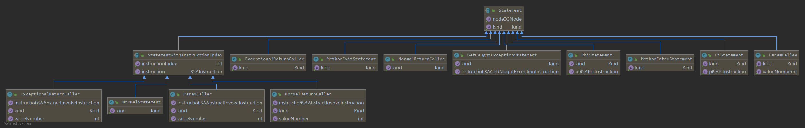

# 安装依赖
* Graphviz
    https://graphviz.gitlab.io/

# 程序切片

假设有目标程序：

```java
package top.anemone.walatarget;

import java.io.IOException;

public class Main {
    public static void main(String[] args) throws IOException {
        String s=source();
        s=replace(s);
        sink(s);
    }
    public static String source(){
        return "calc";
    }
    public static void sink(String cmd) { //caller method
        System.out.println(cmd); //callee method
    }

    public static String replace(String str){
        return str.replace("a","b").replace("c","d");
    }
}
```

想要切与第15行相关的语句

## 0x01 读入jar包并产生继承图

wala是可以读取源代码的，但是其要给定所有依赖，另外在执行范围时，第二个参数为黑名单，即指定不去分析jar包中的某些类，但是如果这些类被用到后面的操作会报错——比如屏蔽了java.lang.Object，后面分析就会报错。

```java
AnalysisScope scope = AnalysisScopeReader.makeJavaBinaryAnalysisScope(appJar,
        (new FileProvider()).getFile(CallGraphTestUtil.REGRESSION_EXCLUSIONS));
ClassHierarchy cha = ClassHierarchyFactory.make(scope);
```

## 0x02 指定入口

在构造调用图时先要指定程序的入口（很像污点传播中的source点），一个程序的入口可以有多个，一个入口是由其<类名，方法名，函数签名>三部分组成。

```java
String[] srcCls = {"Ltop/anemone/walatarget/Main"};
String[] srcFuncs= {"main"};
String[] srcRefs = {"([Ljava/lang/String;)V"};
Iterable<Entrypoint> entrypoints = ()-> new Iterator<Entrypoint>() {
    private int index = 0;

    @Override
    public void remove() {
        Assertions.UNREACHABLE();
    }

    @Override
    public boolean hasNext() {
        return index < srcCls.length;
    }

    @Override
    public Entrypoint next() {
        TypeReference T =
                TypeReference.findOrCreate(scope.getApplicationLoader(),
                        TypeName.string2TypeName(srcCls[index]));
        MethodReference mainRef =
                MethodReference.findOrCreate(T,
                        Atom.findOrCreateAsciiAtom(srcFuncs[index]),
                        Descriptor.findOrCreateUTF8(srcRefs[index]));
        index++;
        return new DefaultEntrypoint(mainRef, cha);
    }
};
AnalysisOptions options = new AnalysisOptions(scope, entrypoints);
```

## 0x03 构造调用图

设置入口后，使用以下代码构造调用图

```java
com.ibm.wala.ipa.callgraph.CallGraphBuilder cgb = Util.makeVanillaZeroOneCFABuilder(Language.JAVA, options, new AnalysisCacheImpl(), cha, scope, null, null);
CallGraph cg = cgb.makeCallGraph(options, null);
PointerAnalysis pa = cgb.getPointerAnalysis();
```

## 0x04 指定出口

WALA是通过caller+callee来定位要切片的语句的，所以先搜索caller函数，在样例中即`sink(String cmd)`：

### 搜索caller

```java
String[] callerMethod=caller.split("#");
String clazz=callerMethod[0].replace('.','/');
Atom method=Atom.findOrCreateUnicodeAtom(callerMethod[1]);
CGNode callerNode=null;
for(CGNode n: cg){
    if (n.getMethod().getReference().getDeclaringClass().getName().toString().endsWith(clazz) && n.getMethod().getName().equals(method)) {
        callerNode=n;
        break;
    }
}
if(callerNode==null){
    Assertions.UNREACHABLE("failed to find method");
}
```

### 搜索callee

接着搜索callee函数，在样例中即第15行`System.out.println(cmd);`

```java
Statement calleeStmt=null;
IR callerIR = callerNode.getIR();
for (SSAInstruction s: Iterator2Iterable.make(callerIR.iterateAllInstructions())){
    if (s instanceof com.ibm.wala.ssa.SSAAbstractInvokeInstruction) {
        com.ibm.wala.ssa.SSAAbstractInvokeInstruction call = (com.ibm.wala.ssa.SSAAbstractInvokeInstruction) s;
        if (call.getCallSite().getDeclaredTarget().getName().toString().equals(callee)) {
            com.ibm.wala.util.intset.IntSet indices = callerIR.getCallInstructionIndices(call.getCallSite());
            com.ibm.wala.util.debug.Assertions.productionAssertion(indices.size() == 1, "expected 1 but got " + indices.size());
            calleeStmt=new com.ibm.wala.ipa.slicer.NormalStatement(callerNode, indices.intIterator().next());
        }
    }
}
if(calleeStmt==null){
    Assertions.UNREACHABLE("failed to find call to " + callee + " in " + callerNode);
}
```

## 0x04 切片并打印结果

理论上第一条语句就已经完成切片了，后面生成SDG纯粹用来切条跟程序无关的程序片（例如在java rt中的程序片——“Primordial”）

```java
Collection<Statement> slice = Slicer.computeBackwardSlice(calleeStmt, cg, pa, dOptions, cOptions);

SDG<InstanceKey> sdg=new SDG<InstanceKey>(cg, pa, dOptions, cOptions);
// filter primordial stmt
Predicate<Statement> filter = o -> slice.contains(o) && !o.toString().contains("Primordial") && o.getKind() == Statement.Kind.NORMAL;
Graph<Statement> graph = GraphSlicer.prune(sdg, filter);
for (Statement s : graph) {
//            System.out.println(s);
    // print stmt in a beautiful way
    System.out.println(StmtFormater.format(s));
}
```

程序输出类似如下(运行top.anemone.walaDemo.SimpleSlice)：

```java
in method:main, at line:7, inst:4 = invokestatic < Application, Ltop/anemone/walatarget/Main, source()Ljava/lang/String; > @0 exception:3
in method:main, at line:7, inst:6 = invokestatic < Application, Ltop/anemone/walatarget/Main, replace(Ljava/lang/String;)Ljava/lang/String; > 4 @5 exception:5
in method:main, at line:8, inst:invokestatic < Application, Ltop/anemone/walatarget/Main, sink(Ljava/lang/String;)V > 6 @10 exception:7
in method:source, at line:12, inst:return 2
in method:replace, at line:19, inst:6 = invokevirtual < Application, Ljava/lang/String, replace(Ljava/lang/CharSequence;Ljava/lang/CharSequence;)Ljava/lang/String; > 1,3,4 @5 exception:5
in method:replace, at line:19, inst:10 = invokevirtual < Application, Ljava/lang/String, replace(Ljava/lang/CharSequence;Ljava/lang/CharSequence;)Ljava/lang/String; > 6,7,8 @12 exception:9
in method:replace, at line:19, inst:return 10
in method:sink, at line:15, inst:3 = getstatic < Application, Ljava/lang/System, out, <Application,Ljava/io/PrintStream> >
in method:sink, at line:15, inst:invokevirtual < Application, Ljava/io/PrintStream, println(Ljava/lang/String;)V > 3,1 @4 exception:4
```

## 0x05 处理caller中有多个callee情况

之前程序时通过caller+callee唯一标识一个切片sink点的，但如果被切片程序中的sink方法如下：

```java
public static void sink(String cmd) {
    System.out.println(cmd); //line 15 in real
    cmd=cmd+1;
    System.out.println(cmd); //line 17 in real
}
```

那么就会产生混淆，因此在判断callee时可以增加行号的判断，选择里行号最近的一处callee（理论上dist==0）：

```java
Statement calleeStmt = null;
// the closest code will be callee stmt.
int dist = 987654321;
IR callerIR = callerNode.getIR();
for (SSAInstruction s : Iterator2Iterable.make(callerIR.iterateAllInstructions())) {
    if (s instanceof com.ibm.wala.ssa.SSAAbstractInvokeInstruction) {
        com.ibm.wala.ssa.SSAAbstractInvokeInstruction call = (com.ibm.wala.ssa.SSAAbstractInvokeInstruction) s;
        if (call.getCallSite().getDeclaredTarget().getName().toString().equals(callee)) {
            com.ibm.wala.util.intset.IntSet indices = callerIR.getCallInstructionIndices(call.getCallSite());
            com.ibm.wala.util.debug.Assertions.productionAssertion(indices.size() == 1, "expected 1 but got " + indices.size());
            Statement candidateStmt = new com.ibm.wala.ipa.slicer.NormalStatement(callerNode, indices.intIterator().next());
            int candidateLineNumber=candidateStmt.getNode().getMethod().getSourcePosition(((NormalStatement)candidateStmt).getInstructionIndex()).getFirstLine();
            int currentDist=Math.abs(candidateLineNumber-lineNumber);
            if(currentDist<dist){
                calleeStmt=candidateStmt;
                dist=currentDist;
            }
        }
    }
}
```

## 分析切片结果

切片返回Statement，其为一个抽象类，有各种实现，其本身有node和kind属性，`top.anemone.walaDemo.utils.StmtFormater`写着一些打印这些属性的方法。



## Challenge
* 切片使用了类似先序遍历，顺序有点不一致(分段切片？)

* 只有操作码，没有实际操作数

* 将污点分析结果匹配到切片是会包含无意义分支，例如

  ```mermaid
  graph TB
     source ==> if
     if --y--> clean
     if ==n==> unclean
     clean --> sink
     unclean ==>sink
  ```

  污点延粗线传播，但是切片结果会包含clean部分：

  ```java
  in method:main, at line:6, inst:4 = arrayload 1[3]
  in method:main, at line:6, inst:7 = invokevirtual < Application, Ljava/lang/String, equals(Ljava/lang/Object;)Z > 4,5 @5 exception:6
  in method:main, at line:6, inst:conditional branch(eq, to iindex=13) 7,8
  in method:main, at line:6, inst:13 = arrayload 1[9]
  in method:main, at line:6, inst:15 = invokestatic < Application, Ltop/anemone/walaTarget/Branch, clean(Ljava/lang/String;)Ljava/lang/String; > 13 @14 exception:14
  in method:main, at line:7, inst:10 = arrayload 1[9]
  in method:main, at line:7, inst:12 = invokestatic < Application, Ltop/anemone/walaTarget/Branch, unclean(Ljava/lang/String;)Ljava/lang/String; > 10 @24 exception:11
  in method:main, at line:7, inst:invokestatic < Application, Ltop/anemone/walaTarget/Branch, sqlselect(Ljava/lang/String;)V > 16 @29 exception:17
  in method:clean, at line:15, inst:6 = invokevirtual < Application, Ljava/lang/String, replace(Ljava/lang/CharSequence;Ljava/lang/CharSequence;)Ljava/lang/String; > 1,3,4 @5 exception:5
  in method:clean, at line:15, inst:return 6
  in method:unclean, at line:18, inst:return 1
  ```

  

